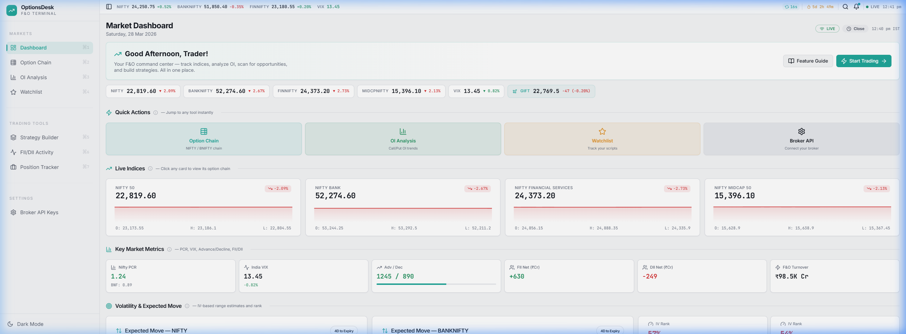
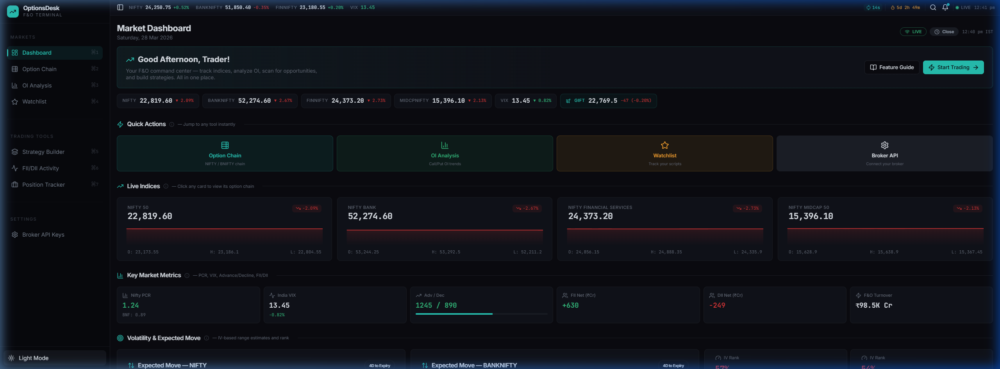
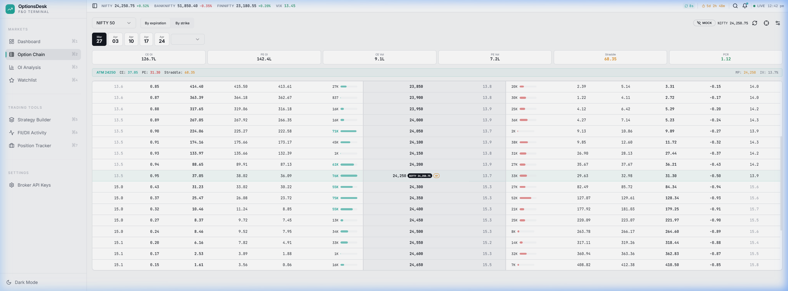
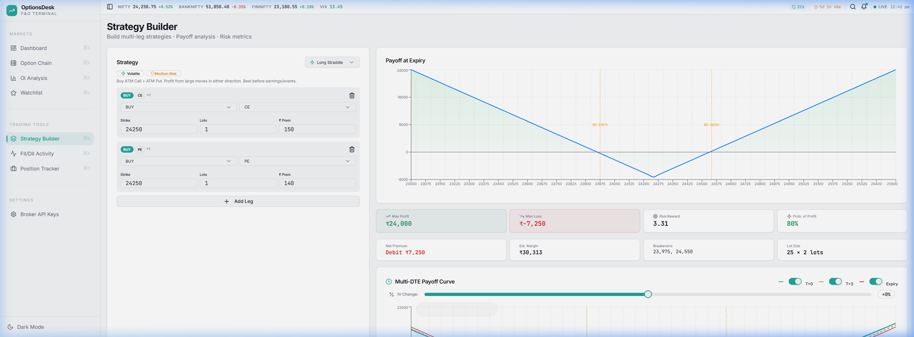
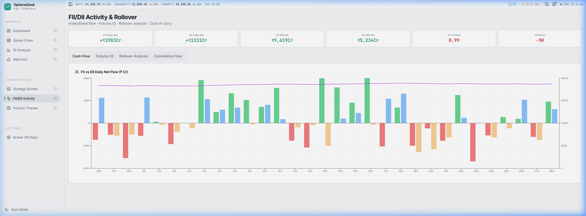
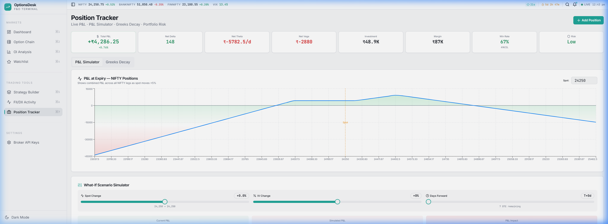

# Mr. Chartist — Options Terminal | NSE F&O Analytics

<div align="center">



**India's most comprehensive open-source Options & Futures analytics terminal.**
Built by **Mr. Chartist** for traders who need institutional-grade tools without the institutional price tag.

[](https://react.dev)
[](https://typescriptlang.org)
[](https://vitejs.dev)
[](https://tailwindcss.com)
[](LICENSE)
[](https://github.com/sponsors/MrChartist)

[Live Demo](#quick-start) · [Features](#-features) · [Screenshots](#-screenshots) · [Setup Guide](#-getting-started) · [API Docs](#-data-architecture) · [Sponsor](#-sponsor) · [Contributing](#-contributing)

</div>

---

## 🧠 Why Mr. Chartist Options Terminal?

Most F&O terminals in India are either:
- **Locked behind expensive broker subscriptions** (Sensibull, Opstra)
- **Too basic for serious analysis** (free tools)
- **Desktop-only** with no mobile/responsive support

**Mr. Chartist Options Terminal** bridges this gap — a fully responsive, real-time, broker-agnostic F&O analytics platform that works in your browser. Plug in your own broker API key (Dhan supported, more coming) and get institutional-grade data flowing in seconds.

---

## ✨ Features

### 📊 Market Dashboard
- **Live Index Tracking** — NIFTY 50, BANK NIFTY, FINNIFTY, MIDCAP NIFTY with real-time LTP, change %, and intraday sparklines
- **India VIX & GIFT Nifty** — Pre-market direction and volatility context
- **Key Metrics** — PCR, VIX, Advance/Decline ratio, FII/DII net flows at a glance
- **IV Rank Scanner** — Multi-symbol IV analysis with buy/sell premium signals
- **Expected Move Calculator** — IV-based range estimates for NIFTY and BANKNIFTY by expiry
- **Sector Heatmap** — Color-coded sector performance map for rotation analysis
- **Market Breadth** — Advance/Decline, 52W Highs/Lows, Stocks above EMA, sector rotation charts
- **Most Active F&O** — Strongest buildup signals (Long Buildup, Short Covering, etc.)

### ⛓️ Option Chain
- **Full Strike-Level Data** — LTP, OI, OI Change, Volume, IV for all CE/PE strikes
- **Real-Time Greeks** — Delta, Gamma, Theta, Vega per strike
- **Multi-Expiry Support** — Switch between weekly and monthly expiries instantly
- **ATM Highlighting** — Automatic at-the-money detection with visual emphasis
- **Max Pain Indicator** — Calculated and displayed in the header
- **Quick Trade** — One-click "Buy/Sell" buttons that pre-populate the Strategy Builder
- **PCR & Total OI** — Live Put-Call Ratio with OI distribution bar

### 📈 OI Analysis
- **OI vs Price Chart** — Stacked area visualization of Call/Put OI with price overlay
- **Change in OI** — Spot intraday OI buildup patterns
- **Strike-Wise Distribution** — Bar chart of OI concentration across strikes
- **Multi-Expiry Comparison** — Overlay OI curves across different expiry dates

### 🧮 Strategy Builder
- **Multi-Leg Payoff** — Build any combination of CE/PE Buy/Sell with up to N legs
- **Preset Strategies** — Bull Call Spread, Iron Condor, Straddle, Strangle, Butterfly, and more — pre-loaded with one click
- **Visual Payoff Chart** — Interactive area chart with breakeven lines, spot reference, and profit/loss zones
- **Risk Metrics Panel** — Max Profit, Max Loss, Risk:Reward ratio, Probability of Profit
- **Greeks Dashboard** — Combined position Delta, Gamma, Theta, Vega  
- **Margin Estimator** — Approximate margin requirement based on SPAN logic
- **Multi-DTE Payoff** — See how your strategy decays across different days-to-expiry

### 🏛️ FII/DII Activity
- **Daily Institutional Flows** — FII and DII buy/sell data across Cash, F&O, and combined segments
- **Trend Analysis** — Rolling net flow charts showing institutional sentiment over time
- **Monthly Aggregates** — Cumulative FII/DII positioning for macro context

### 💼 Position Tracker
- **Portfolio Dashboard** — Track all active option positions with real-time MTM P&L
- **P&L Simulator** — What-if scenarios: "What happens if NIFTY moves +2% tomorrow?"
- **Greeks Decay** — Watch how your position Greeks evolve as time passes
- **Risk Alerts** — Configurable alerts for margin breach, P&L thresholds, and Greeks limits
- **Multi-Broker** — Works with any connected broker API

### 🔗 Broker Integration
- **BYOK (Bring Your Own Key)** — Connect your own Dhan API credentials
- **Secure Storage** — Keys stored in browser `localStorage` — never sent to any third-party server
- **Easy Configuration** — Simple setup form with validation and connection testing

### 🎨 UI/UX
- **Dual Theme** — Professional dark mode (terminal-style) and clean light mode
- **Fully Responsive** — Works on desktop, tablet, and mobile
- **Keyboard Shortcuts** — `⌘1`–`⌘7` for instant page navigation
- **Micro-Animations** — Staggered fade-ins, glow effects, smooth transitions
- **JetBrains Mono** — Monospaced font for all numerical data for perfect alignment

---

## 📸 Screenshots

<details>
<summary><strong>🌙 Dashboard — Dark Mode</strong></summary>


</details>

<details>
<summary><strong>☀️ Dashboard — Light Mode</strong></summary>



</details>

<details>
<summary><strong>⛓️ Option Chain</strong></summary>



</details>

<details>
<summary><strong>🧮 Strategy Builder</strong></summary>



</details>

<details>
<summary><strong>🏛️ FII/DII Activity</strong></summary>



</details>

<details>
<summary><strong>💼 Position Tracker</strong></summary>



</details>

---

## 🚀 Getting Started

### Prerequisites

- [Node.js](https://nodejs.org/) v18+ (LTS recommended)
- [npm](https://www.npmjs.com/) v9+ or [yarn](https://yarnpkg.com/)
- A [Supabase](https://supabase.com/) project (for the Edge Function proxy — see below)
- *(Optional)* A [Dhan](https://dhanhq.co/) trading account for live market data

### Quick Start

```bash
# 1. Clone the repository
git clone https://github.com/MrChartist/india-s-best-option-hub.git
cd india-s-best-option-hub

# 2. Install dependencies
npm install

# 3. Configure environment variables
cp .env.example .env
# Edit .env with your Supabase project details (see below)

# 4. Start the development server
npm run dev
```

The app will be running at **http://localhost:4001**

### Environment Variables

Create a `.env` file in the project root:

```env
# ── Supabase (Required for live data) ──
VITE_SUPABASE_URL=https://YOUR_PROJECT_ID.supabase.co
VITE_SUPABASE_PUBLISHABLE_KEY=your_supabase_anon_public_key
VITE_SUPABASE_PROJECT_ID=YOUR_PROJECT_ID

# Note: If these are not set, the app will gracefully fall back to built-in
# mock data, so you can explore the UI without any backend setup.
```

> **💡 No Supabase?** No problem. The app ships with comprehensive mock data for all pages. Just run `npm run dev` and explore everything — live data is optional.

---

## 🏗️ Data Architecture

Mr. Chartist Options Terminal uses a **3-tier data fallback** architecture to ensure the app always works:

```
┌──────────────────────────────────────────────┐
│                Browser (React)               │
├──────────────────────────────────────────────┤
│  useQuery hooks with automatic retry/cache   │
│  (React Query — 5s/30s refresh intervals)    │
├──────────────────────────────────────────────┤
│                                              │
│  Tier 1: Dhan Broker API  ← Primary         │
│  (Option Chain, Expiry Lists, Greeks, OI)    │
│  Uses YOUR API key via Supabase Edge Fn      │
│                                              │
│  Tier 2: NSE Direct Proxy  ← Fallback       │
│  (Live Indices, Market Status, GIFT Nifty)   │
│  No auth needed, via Supabase Edge Fn        │
│                                              │
│  Tier 3: Mock Data  ← Offline/Demo          │
│  (Full synthetic dataset for all pages)      │
│  Works without any backend                   │
│                                              │
└──────────────────────────────────────────────┘
```

| Data Source | What It Provides | Auth Required? |
|-------------|-----------------|---------------|
| **Dhan API** | Option chain, Greeks, IV, Expiry lists | Yes (your API key) |
| **NSE Proxy** | Live indices, market status, GIFT Nifty, F&O stock list | No |
| **Mock Data** | Complete synthetic dataset for all features | No |

### Connecting Your Dhan Broker

1. Go to [Dhan Developer Portal](https://dhanhq.co/docs/v2/) and create an API app
2. Copy your **Client ID** and **Access Token**
3. In the app, navigate to **Settings → Broker API Keys**
4. Enter your credentials and save
5. The option chain will automatically switch to live data

> **🔒 Security:** Your broker credentials are stored **only in your browser's localStorage**. They are sent to your own Supabase Edge Function (which you control), never to any third-party server.

---

## 🧱 Tech Stack

| Layer | Technology | Purpose |
|-------|-----------|---------|
| **Framework** | React 18 + TypeScript | Component architecture with type safety |
| **Build Tool** | Vite 5 | Lightning-fast HMR and builds |
| **Routing** | React Router v6 | Client-side navigation |
| **State/Data** | TanStack React Query | Server state management with caching |
| **UI Components** | shadcn/ui + Radix | Accessible, customizable component library |
| **Styling** | Tailwind CSS 3 + CSS Variables | Utility-first with design token system |
| **Charts** | Recharts | Composable chart components |
| **Backend** | Supabase Edge Functions | Serverless API proxy (CORS bypass) |
| **Broker API** | Dhan API v2 | Live market data |
| **Typography** | Inter + JetBrains Mono | UI text + monospaced data display |
| **Testing** | Vitest + Playwright | Unit and E2E testing |

---

## 📁 Project Structure

```
india-s-best-option-hub/
├── public/                    # Static assets
├── docs/
│   └── screenshots/           # App screenshots for README
├── src/
│   ├── components/
│   │   ├── ui/                # shadcn/ui base components
│   │   ├── dashboard/         # Dashboard section components
│   │   ├── AppSidebar.tsx     # Main navigation sidebar
│   │   ├── DashboardLayout.tsx # Layout wrapper with sidebar
│   │   ├── ExpectedMoveWidget.tsx
│   │   ├── IVPercentileGauge.tsx
│   │   ├── IVRankWidget.tsx
│   │   └── ...
│   ├── hooks/
│   │   ├── useNSEData.ts      # Data hooks (live + mock fallback)
│   │   ├── useTheme.ts        # Dark/light mode toggle
│   │   ├── useAlertEngine.ts  # Alert system logic
│   │   └── useKeyboardShortcuts.ts
│   ├── integrations/
│   │   └── supabase/          # Supabase client config
│   ├── lib/
│   │   ├── nseApi.ts          # Dhan + NSE API layer
│   │   ├── mockData.ts        # Comprehensive mock dataset
│   │   ├── brokerConfig.ts    # Multi-broker BYOK config
│   │   └── utils.ts
│   ├── pages/
│   │   ├── Index.tsx          # Dashboard
│   │   ├── OptionChain.tsx    # Full option chain
│   │   ├── OIAnalysis.tsx     # OI analysis & charts
│   │   ├── Watchlist.tsx      # Custom watchlist
│   │   ├── StrategyBuilder.tsx # Multi-leg strategy builder
│   │   ├── FIIDIIActivity.tsx # Institutional flow data
│   │   ├── PositionTracker.tsx # Position & P&L tracking
│   │   └── BrokerSettings.tsx # API key management
│   ├── index.css              # Design system (CSS variables)
│   ├── App.tsx                # Routes & providers
│   └── main.tsx               # Entry point
├── .env.example               # Environment variable template
├── .gitignore
├── package.json
├── tailwind.config.ts
├── vite.config.ts
└── tsconfig.json
```

---

## 🎨 Design System

Mr. Chartist Options Terminal uses a **CSS variable-based** dual-theme design system:

| Token | Dark Mode | Light Mode |
|-------|-----------|------------|
| `--background` | `hsl(225, 25%, 5%)` — Deep Navy | `hsl(220, 16%, 96%)` — Soft Gray |
| `--card` | `hsl(225, 22%, 8%)` — Elevated Surface | `hsl(0, 0%, 100%)` — White |
| `--primary` | `hsl(174, 72%, 44%)` — Teal | `hsl(174, 72%, 38%)` — Teal |
| `--bullish` | `hsl(152, 60%, 44%)` — Green | `hsl(152, 60%, 36%)` — Green |
| `--bearish` | `hsl(0, 68%, 52%)` — Red | `hsl(0, 68%, 50%)` — Red |
| `--warning` | `hsl(38, 92%, 50%)` — Amber | `hsl(38, 92%, 46%)` — Amber |

---

## 📜 Available Scripts

```bash
npm run dev        # Start dev server (http://localhost:4001)
npm run build      # Production build
npm run preview    # Preview production build
npm run test       # Run unit tests (Vitest)
npm run test:watch # Run tests in watch mode
npm run lint       # ESLint check
```

---

## 🛣️ Roadmap

- [ ] **More Broker Integrations** — Zerodha, Upstox, and more via BYOK
- [ ] **Real-Time WebSocket Feeds** — Sub-second data updates
- [ ] **PWA Support** — Install as a native app on mobile
- [ ] **Community Features** — Share strategies, discuss setups

---

## ❤️ Sponsor

If Mr. Chartist Options Terminal saves you time or helps your trading, consider sponsoring the project to keep it alive and growing.

<div align="center">

[](https://github.com/sponsors/MrChartist)

</div>

### Sponsorship Tiers

| Tier | Amount | Perks |
|------|--------|-------|
| ☕ **Supporter** | $5/mo | Your name in the README sponsors list |
| 🚀 **Pro Trader** | $15/mo | Name in README + Priority feature requests + Early access to new features |
| 💎 **Institutional** | $50/mo | Logo in README + All Pro perks + Private Discord channel + Direct support |

### 🌟 Sponsors

<!-- sponsors -->
*Become the first sponsor and your name will appear here!*
<!-- /sponsors -->

---

## 🤝 Contributing

Contributions are welcome! Please follow these steps:

1. **Fork** the repository
2. **Create** a feature branch (`git checkout -b feature/amazing-feature`)
3. **Commit** your changes (`git commit -m 'Add amazing feature'`)
4. **Push** to the branch (`git push origin feature/amazing-feature`)
5. **Open** a Pull Request

### Development Guidelines

- Use TypeScript for all new code
- Follow the existing component structure in `src/components/`
- Use the design token system (CSS variables) — no hardcoded colors
- Write unit tests for utility functions
- Ensure both light and dark themes render correctly

---

## ⚠️ Disclaimer

This project is for **educational and analytical purposes only**. It is not financial advice. Trading in derivatives involves significant risk and may result in loss of capital. Always do your own research and consult a registered financial advisor before making trading decisions.

The developers of this project are not responsible for any financial losses incurred while using this software.

---

## 📄 License

This project is licensed under the **MIT License** — see the [LICENSE](LICENSE) file for details.

---

<div align="center">

**Built with ❤️ by Mr. Chartist for the Indian Options Trading Community**

*If this project helps your trading, consider giving it a ⭐*

</div>
